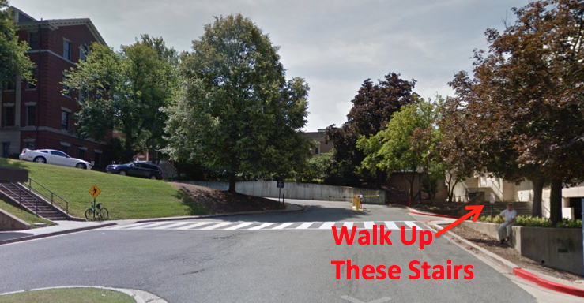

<h2>Washington DC</h2>

<h3>Location:</h3>
  
  Room SW107, 1st Floor Medical/Dental (aka MedDent) Building 
  Georgetown University Medical Center <a href="https://www.google.com/maps?mrsp=1&daddr=38.91210810,-77.07693540(Medical+and+Dental+Building)" target="_blank">[Directions]</a> 
  3900 Reservoir Road NW 
  Washington DC, 20057 
  
  On Saturday you can park for free in any non-metered parking spots (green arrows on the map). On Sunday you can park for free anywhere including metered spots (yellow arrows). Do not park in any of the Georgetown spaces - you will get a very heft ticket (~$100) from GU!

  For those of you taking public transportation the D6 Metrobus is probably your best option. Also, Georgetown operates a shuttle from the DuPont and Rosslyn Metro stops but it only runs on Saturday and doesn't start until about noon (see http://otm.georgetown.edu/guts/).
  
  We will be located in the Medical/Dental (aka MedDent) Building on the first floor in room SW107. From Reservoir Road, you want to walk to Entrance 3, take the stairs on your right all the up to the top and then turn left. Keep going past the fountain and then turn right. At this point, the building on your left is MedDent. MedDent SW107 is located just before you get to a large open area and a set of stairs going down. On weekends, the medical center buildings are locked but you can knock to get into SW107.  We will post signs to help direct you.

 
<h3>Registration:</h3>
<a href="http://www.payitsquare.com/collect-page/51435" target="_blank">Sign up online.</a> Registration costs $12.50 for non-students and is free for students who volunteer to work at the event.

<h3>Other Information:</h3>

<ul>
    <li>Amazon is providing credits for cloud computing ($100 per person): register <a href="http://aws.amazon.com/activate/wdm/brainhackedt87513/" target="_blank">here</a>.</li>    
</ul>

  
<h3>Schedule:</h3>
  
<table border="0">
<tbody>
<tr>
<td colspan="2"><strong>Saturday, October 18, 2014</strong></td>
</tr>
<tr>
<td width="10%">08:30</td>
<td>Attendee Arrival</td>
</tr>
<tr>
<td>09:00</td>
<td>Welcome reception and icebreaker</td>
</tr>
<tr>
<td>10:00</td>
<td>Ignite Talk #1: <strong>Dan Hall</strong>, National Database for Autism Research<a href="" target="_blank">click here to tune in.</a></td>
</tr>
<tr>
<td>10:15</td>
<td>Open Hacking</td>
</tr>
<tr>
<td>13:30</td>
<td>Unconference Session, <a href="" target="_blank">click here to tune in.</a></td>
</tr>
<tr>
<td>15:00</td>
<td>Open Hacking</td>
</tr>
<tr>
<td colspan="2"></td>
</tr>
</tbody>
</table> &nbsp;

<table border="0">
<tbody>
<tr>
<td colspan="2"><strong>Sunday, October 19, 2014</strong></td>
</tr>
<tr>
<td width="10%">09:00</td>
<td>Attendee Arrival, Open Hacking</td>
</tr>
<tr>
<td>10:00</td>
<td>Ignite Session #2: </td>
</tr>
<tr>
<td>10:15</td>
<td>Unconference Session, <a href="" target="_blank">click here to tune in.</a></td>
</tr>
<tr>
<td>11:00</td>
<td>Open Hacking</td>
</tr>
<tr>
<td>17:00</td>
<td>Project Summaries and Wrap-up, <a href="" target="_blank">click here to tune in.</a></td>
</tr>
<tr>
<td>18:30</td>
<td>Adjourn</td>
</tr>
</tbody>
</table>
  
<h3>Organizers:</h3>
<ul>
	<li>John Van Meter, PhD, Associate Professor, Department of Neurology, Director, Center for Functional and Molecular Imaging, Georgetown University Medical Center, Washington DC</li>
	<li>Lei Liew, PhD, MA, OTR/L, Postdoctoral Research Fellow, Human Cortical Physiology and Neurorehabilitation Section, National Institute of Neurological Disorders and Stroke, Bethesda, MD</li>
	<li>Ziad Saad, PhD, Scientific and Statistical Computing Core Facility, Research Fellow, National Institute of Mental Health, Bethesda, MD</li>
	<li>Prantik Kundu, PhD, Assistant Professor of Radiology and Psychiatry, Icahn School of Medicine at Mount Sinai, New York, NY</li>
</ul>

<h3>Sponsors:</h3>

<ul>
	<li><strong><a title="GUSOM" href="http://som.georgetown.edu/" target="_blank">Georgetown University School of Medicine</a></strong></li>
    <li><strong><a title="AWS" href="http://aws.amazon.com/" target="_blank">Amazon Web Services</a></strong></li>
</ul>